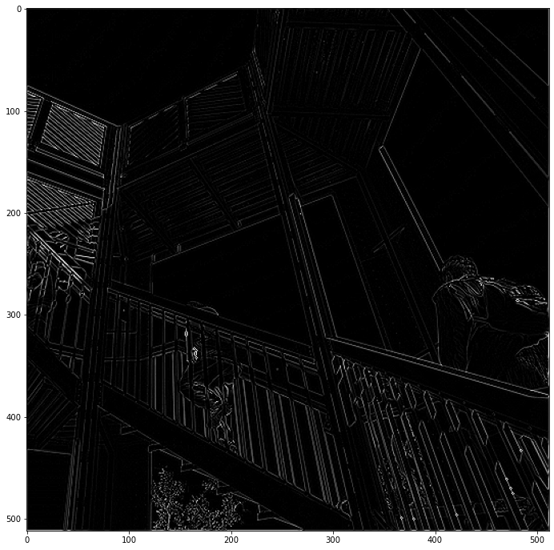
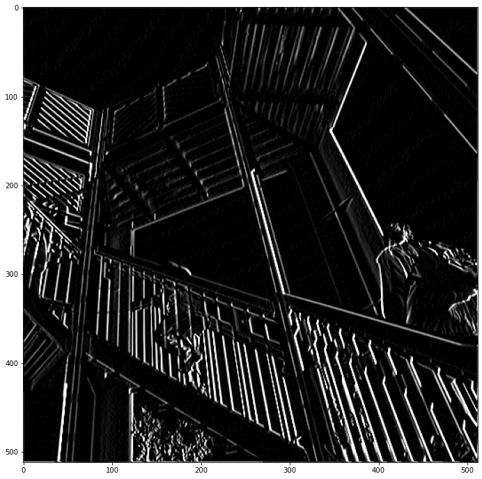
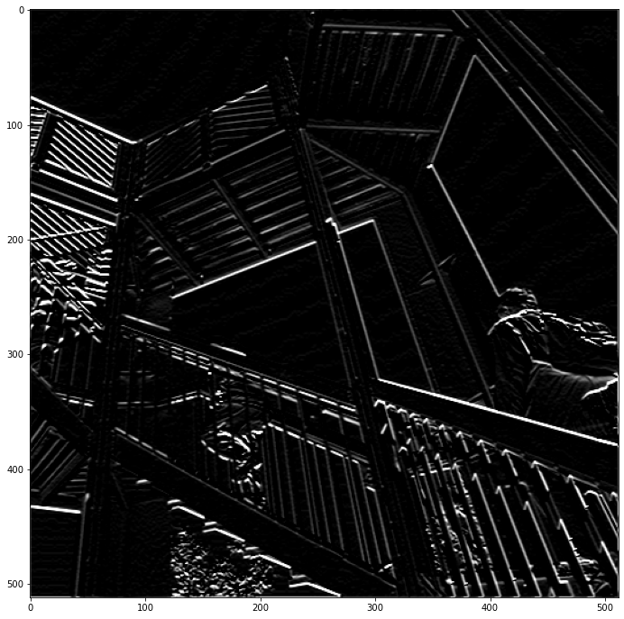
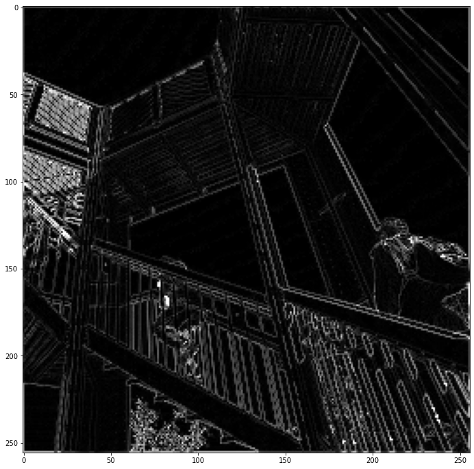

# how-does-convolutions-work

Here we can see how `CNN` filters and `Max Pooling` work by visualizing their effects on images.

## Table of contents

- [Getting started](#getting-started)
- [Visualizations](#visualizations)
- [License](#license)

## Getting started

The [notebook](https://www.kaggle.com/akashsdas/us-covid19-eda) is available on Kaggle to work in the same environment where this notebook was created i.e. use the same version packages used, etc...

## Visualizations

**Image**

**Random filter effect**

**Vertical filter effect**

**Horizontal filter effect**

**Max Pooling effect**

## License

[APACHE LICENSE, VERSION 2.0](./LICENSE)
